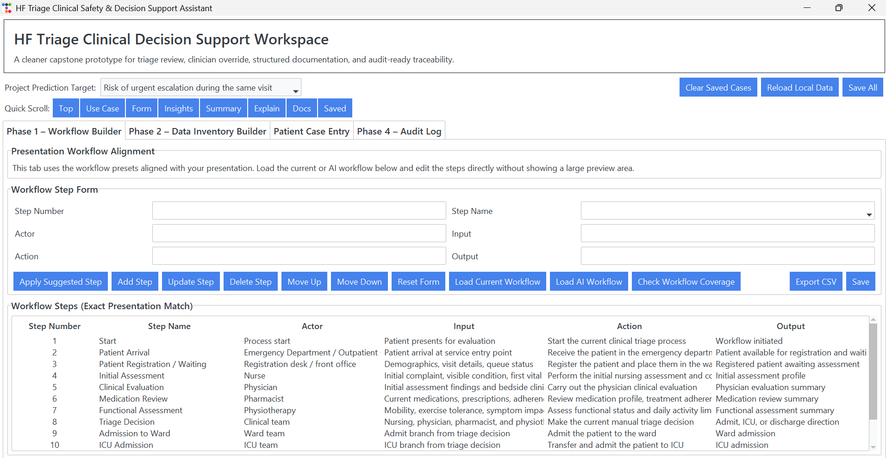
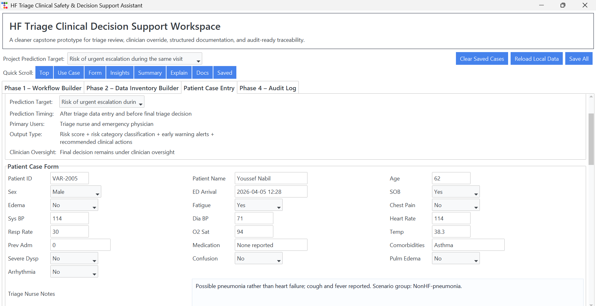
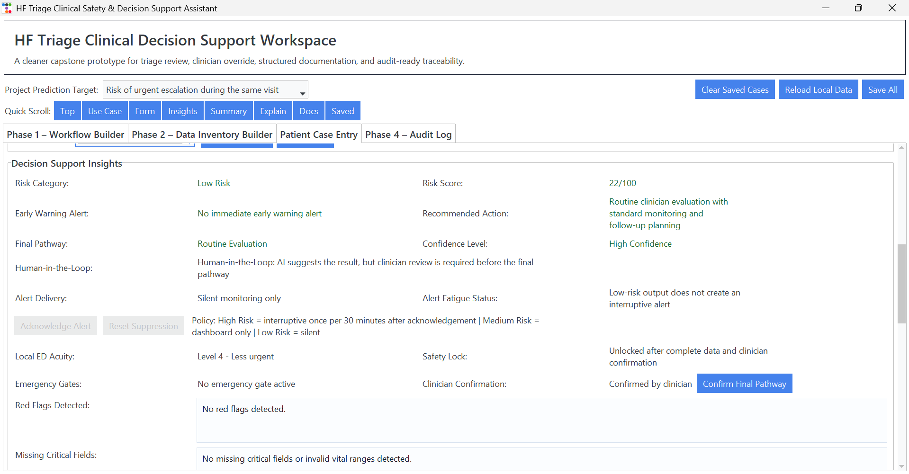
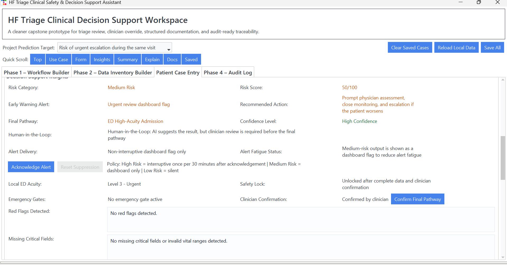
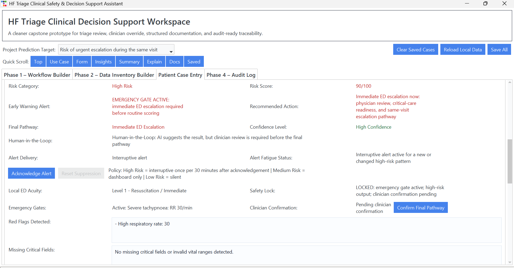
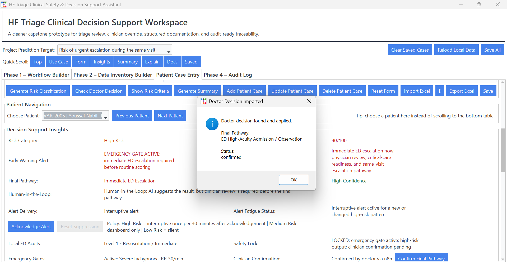
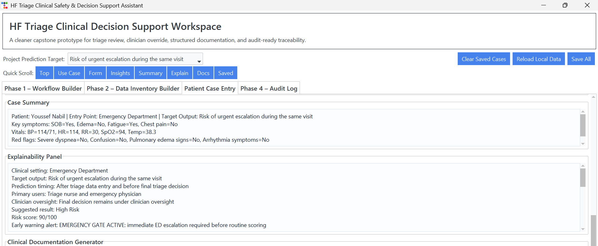
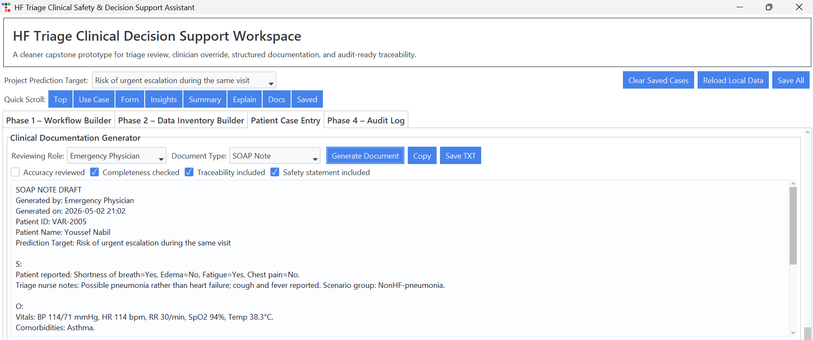
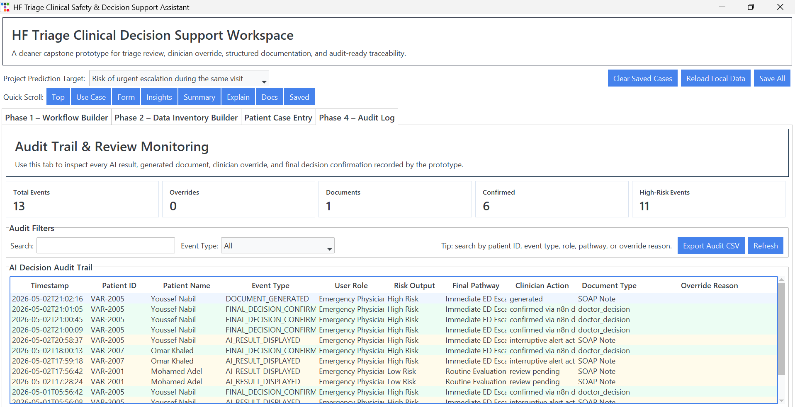

# HF Triage Clinical Decision Support Workspace

## Overview
This is a Python desktop prototype for heart failure triage support.

The system helps triage staff collect patient symptoms, vital signs, red flags, and generate an explainable risk category with a recommended clinical action.

## Important Safety Note
This system is a Clinical Decision Support prototype, not a diagnostic tool.
Final clinical decisions must be confirmed by a qualified clinician.

## Main Features
- Patient case entry
- Vital signs and symptom collection
- Emergency red flag detection
- Risk stratification
- Clinician confirmation and override
- Audit log
- Structured clinical documentation

## How to Run

Install the required packages:

```bash
pip install -r requirements.txt
```

Run the app:

```bash
python hf_triage_app_v35_clinical_safety_FIXED_AUDIT.py
```

---

## Clinical Safety Disclaimer

This project is a rule-based Clinical Decision Support System (CDSS) prototype for heart failure triage support.

It is not a diagnostic tool, not a validated medical device, and not a replacement for clinical judgment.

The system is designed to support triage staff by highlighting possible red flags, risk level, and recommended next actions. Final decisions must always be confirmed by a qualified clinician.

The current version uses predefined clinical safety rules and workflow automation. It does not use a clinically validated machine learning model.

---

## Current Emergency Red Flags

The current prototype checks the following emergency/safety triggers before producing a final triage recommendation:

- Chest pain requiring immediate clinical review
- Severe shortness of breath / respiratory distress
- Confusion or altered mental status
- Suspected pulmonary edema
- Possible unstable arrhythmia symptoms
- Hypotension: systolic BP less than 90 mmHg
- Severe hypoxia: oxygen saturation less than 90%
- Severe tachypnea: respiratory rate 30/min or higher
- Severe tachycardia: heart rate 130 bpm or higher

If any emergency gate is triggered, the system should not allow the case to be downplayed as low risk.

---

## Safety Testing

A simple safety test script is included:

```bash
python test_hf_triage_safety.py
```

---

## Demo Screenshots

### 1. Main Application Home


### 2. Patient Case Entry


### 3. Low Risk Result


### 4. Medium Risk Result


### 5. High Risk / Emergency Gate Result


### 6. Clinician Confirmation / Doctor Decision Import


### 7. Case Summary and Explainability Panel


### 8. SOAP Documentation Generator


### 9. Audit Log and Review Monitoring

